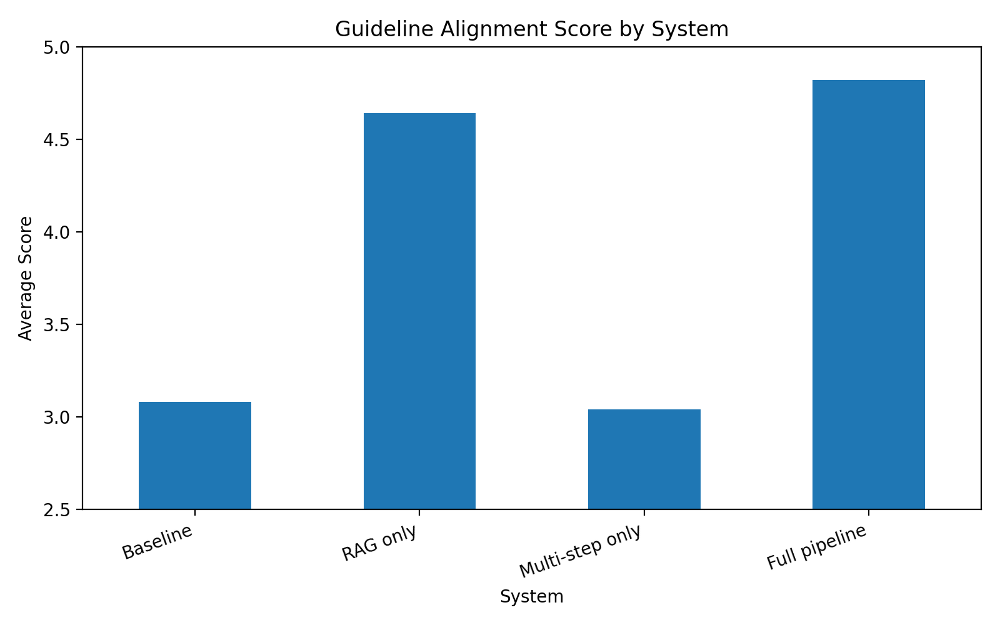
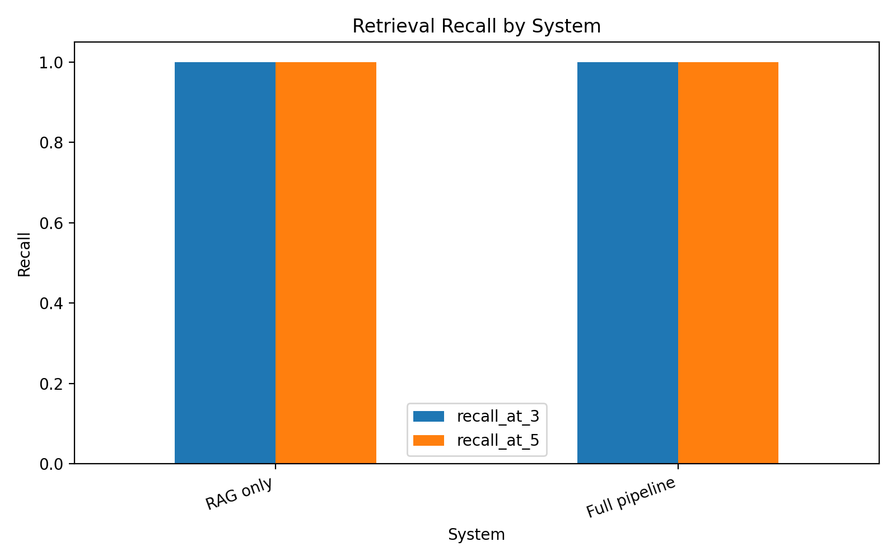

## Health LLM Evaluation

Evaluating LLM Architectures for Personalized Lifestyle Health Recommendations.

## Project Overview

This project compares four LLM system designs for non-clinical lifestyle health recommendation:

1. **Baseline Prompting** — single-prompt generation
2. **RAG only** — retrieval over CDC/WHO guideline chunks + generation
3. **Multi-step only** — profile parsing, risk flagging, generation, safety check
4. **RAG + Multi-step Full Pipeline** — combined retrieval, structured generation, and safety checking

The project evaluates whether retrieval augmentation and multi-step pipeline decomposition improve relevance, personalization, guideline alignment, and safety.

## Key Findings

The strongest finding is that RAG substantially improves guideline alignment.



Retrieval-based systems achieved high topic coverage after removing the expected guideline topic from the retrieval query.



See [`RESULTS.md`](RESULTS.md) for the complete results summary.

## Repository Structure

```text
5293_health_llm_eval/
├── app/
│   └── streamlit_app.py
├── data/
│   ├── scenarios.jsonl
│   └── pilot_scenarios.jsonl
├── guidelines/
│   ├── guideline_chunks.jsonl
│   └── pilot_guideline_chunks.jsonl
├── src/
│   ├── baseline.py
│   ├── rag_only.py
│   ├── multistep_only.py
│   ├── full_pipeline.py
│   ├── retrieval.py
│   ├── safety_classifier.py
│   ├── run_experiment.py
│   ├── evaluate.py
│   ├── statistical_tests.py
│   ├── retrieval_eval.py
│   ├── judge_reliability.py
│   ├── scenario_type_breakdown.py
│   ├── output_length_analysis.py
│   ├── counterfactual_eval.py
│   └── analyze_human_validation.py
├── results/
├── figures/
├── tests/
│   └── test_data_files.py
├── README.md
├── RESULTS.md
├── model_data_card.md
├── requirements.txt
├── .env.example
└── .gitignore
```

## Setup

```bash
python -m venv .venv
source .venv/bin/activate       # macOS/Linux
# .venv\Scripts\activate      # Windows

pip install -r requirements.txt
cp .env.example .env
```

Edit `.env` and add your API key:

```text
OPENAI_API_KEY=your_openai_api_key_here
```

Do not commit `.env`.

## Reproducing the Experiments

### 1. Validate data

```bash
python src/validate_data.py --mode full
```

### 2. Run full experiment

```bash
python src/run_experiment.py --mode full
```

Expected output:

```text
results/model_outputs.csv
```

### 3. Run LLM-as-judge evaluation

```bash
python src/evaluate.py --mode full
```

Expected output:

```text
results/judge_scores.csv
results/judge_summary.csv
```

### 4. Run statistical tests

```bash
python src/statistical_tests.py --mode full
```

Expected output:

```text
results/statistical_results.csv
```

### 5. Run retrieval evaluation

```bash
python src/retrieval_eval.py --mode full
```

Expected output:

```text
results/retrieval_results.csv
results/retrieval_summary.csv
```

### 6. Run robustness checks

```bash
python src/judge_reliability.py --n_outputs 20
python src/scenario_type_breakdown.py
python src/output_length_analysis.py
python src/counterfactual_eval.py --max_cases 10
```

### 7. Generate figures

```bash
python src/plot_results.py --mode full
```
## Lightweight Checks

Before submitting or presenting the project, you can run a lightweight repository check:

```bash
python tests/test_data_files.py
```
## Running the Demo

```bash
streamlit run app/streamlit_app.py
```

The demo includes:

- **Explore Results**: stable precomputed results mode
- **Try a Custom Profile**: live Full Pipeline mode using API calls

For presentation, use **Explore Results** as the default because it does not depend on live API calls.


## Troubleshooting

- If you see `OPENAI_API_KEY is missing`, create a local `.env` file based on `.env.example` and add your API key.
- If Streamlit does not start, run `pip install -r requirements.txt` and then try `streamlit run app/streamlit_app.py` again.
- If the live custom-profile demo is slow or fails, use the `Explore Results` tab. It uses precomputed results and does not require live API calls.
- If the full experiment is slow, do not rerun it during presentation. Use the existing files in `results/`.
- Do not commit `.env`, `venv/`, `.venv/`, or `results/raw_outputs/`.

## Evaluation Metrics

- **Relevance**: Does the response answer the user question?
- **Personalization**: Does the response meaningfully use the profile?
- **Guideline Alignment**: Is the response grounded in CDC/WHO-style guideline evidence?
- **Safety**: Does the response avoid unsafe clinical, medication, or treatment advice?

## Important Limitations

- This is a non-clinical lifestyle recommendation project.
- The system does not provide diagnosis, medication advice, or treatment plans.
- Scenarios are synthetic and do not represent real patients.
- LLM-as-judge results are useful comparative signals, not absolute ground truth.
- Human validation was conducted on a sampled subset.

## Team

- Qianyu Zhang (qz2576)
- Guangyuan Zhao (gz2407)
- Elsie Li (yl5903)

## Course

STAT GR5293 — Generative AI, Spring 2026
